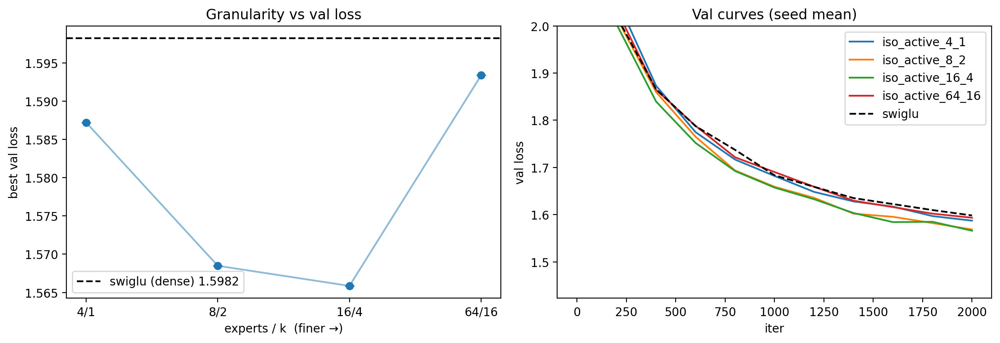
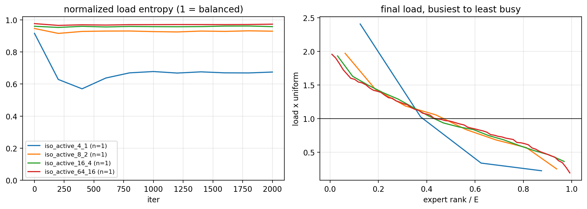
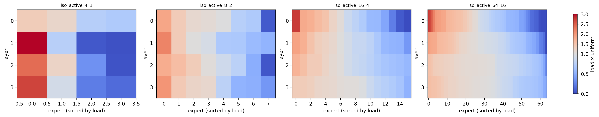
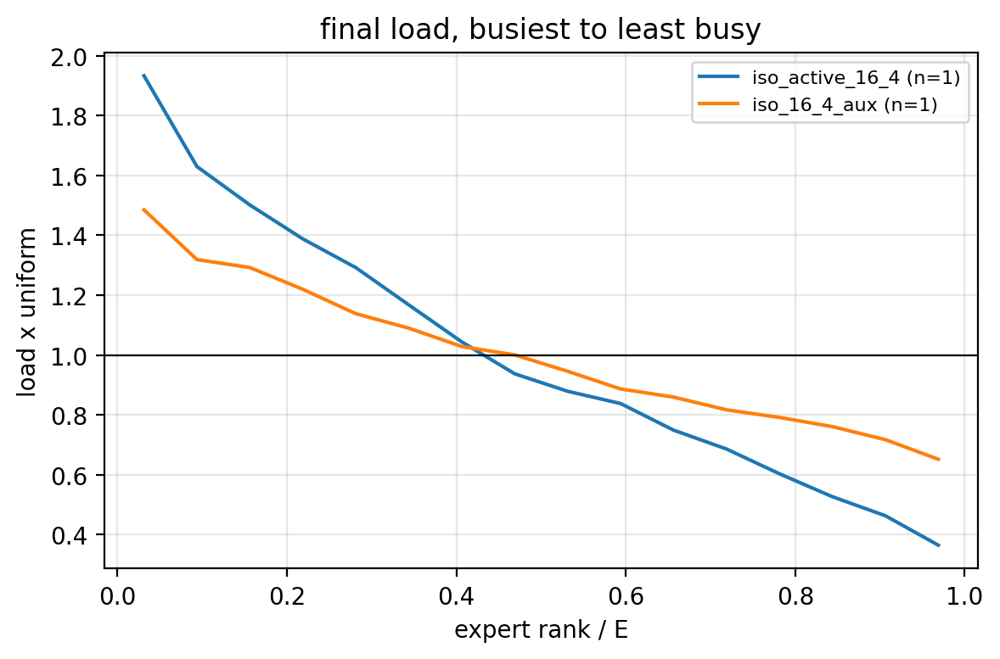

# my experimentation worklog

> setup and bug fixes, baseline calibration, and architecture ablations

1) **Shorter iteraton budget**: To get a trustworthy baseline across variants, I'm giving training and eval their own seeded data generators, both pulled from the base config. Fixed seeds mean any difference between two runs comes from the thing I changed, not from batch order (training), and every run is scored on the same eval batches (otherwise eval noise looks like a real difference). I'm also raising eval_iters from 40 to 200 to further reduce noise, since max_iters has been cut to 2000 and with shorter runs, each eval point matters more.
> Note: 2000 iters * 16 * 128 tokens is about 4M tokens, which is roughly 4 epochs on tinyshakespeare. Pretty less, results won't be representative of the final quality but it's still fine for screening for now.
2) **Bug**: With targets, forward was returning flattened (B*T, C) logits. Generate and any other caller indexing logits[:, -1, :] would then get the wrong shape or the wrong rows. **Fix:** now we're flattening only for cross entropy, while logits maintain their orginal shape.

3) **Sanity check for [mlp + mha + layernorm]**:
```text
[1] logits (32, 128, 65) (want (32, 128, 65))
    initial loss 4.4423  vs ln(vocab)=4.1744  -> OK

[2] params with grad=None: 0   all-zero grad: 0

[3] max diff at earlier positions: 0.00e+00 (want ~0)   at last position: 2.14e+00 (want > 0)
    -> OK

[4] overfitting one batch of 32 x 128 tokens for 300 steps (lr=0.001)
    PASS: loss 0.0095 < 0.1
```
> note: this sanity check is run every time a new module is swapped in (e.g. mlp -> swiglu for the ffn). I only log it again if one of the checks fails; otherwise it's assumed to have passed before the ablation was run.

4) **LR sweep**
<p align="center">
  
</p>

Ran the baseline at 3e-4 (Best val loss = 1.7375), 1e-3 (1.6388) and 3e-3 (1.6414). 3e-3 learns faster early, but 1e-3 catches up and edges ahead by the end, so 1e-3 is the safer baseline and I'm freezing it for all later ablations. **Note:** There's a generalization gap. Val sits about 0.2 above train in every run (e.g. 1.64 vs 1.43 for 1e-3), which is expected on a small char-level dataset.

5) **Baseline x 5 seeds**

Ran the baseline config over 5 seeds; init_seed and train_seed move together; eval_seed stays fixed (at 4242) so every run is scored on the same eval batches.

| seed | best val | best iter | train @ best | gap | params | sec/iter |
|---|---|---|---|---|---|---|
| 1 | 1.6355 | 2000 | 1.4265 | 0.209 | 810,049 | 0.0538 |
| 2 | 1.6307 | 1800 | 1.4333 | 0.197 | 810,049 | 0.0528 |
| 3 | 1.6281 | 2000 | 1.4211 | 0.207 | 810,049 | 0.0518 |
| 4 | 1.6454 | 2000 | 1.4312 | 0.214 | 810,049 | 0.0546 |
| 5 | 1.6441 | 1800 | 1.4419 | 0.202 | 810,049 | 0.0534 |
| **mean ± std** | **1.6368 ± 0.0077** | | | 0.206 ± 0.006 | | 0.0533 |

<p align="center">
    
</p>

- **Decision rule:** Baseline best val is 1.6368 ± 0.0077 over 5 seeds, so a variant is clearly different only if it lands outside the ±2 std band (about 1.621 to 1.652) and is noise if it stays within 1 std. In between, I'll rerun it at seeds 2-5 and count it only if the mean gap exceeds 2 std and the sign matches in at least 4 of 5 paired seeds.
- The gap (val minus train) shows how much the model is overfitting, and its tiny spread (±0.006) means a variant whose gap moves clearly outside 0.206 changed how it generalizes, which tells you whether a val-loss win came from fitting better or from overfitting less.
- Three seeds peaked at iter 2000 and seeds 2 and 5 at 1800, so the runs are still improving slightly at the end of 2000 iterations.

## Ablations

Base config: [mha + mlp + layernorm + rope] lr=1e-3 max_iters=2000. All runs are seed 1 on a Tesla T4, scored against the seed-averaged baseline (best val 1.6368 ± 0.0077; the baseline re-run on Colab T4 gave 1.6355 at 47.7 ms/iter, which is the speed reference below). Deltas are in baseline std units, verdicts follow the decision rule above (noise, real (better), real (worse)).

> Note: ideally each ablation would get its own baseline on multiple seeds, with the decision rule applied against that std, and each win would be stacked into the next ablation (e.g. "swiglu is clearly better, so run the next one on top of it"). For now everything is compared against the same [mlp + mha + layernorm + rope] baseline instead of being a progressive ladder. This is a todo for when I get a fancier gpu.

### 1. Normalization

**1a. RMSNorm vs LayerNorm**
* Hypothesis: <1 std, slightly faster than layernorm (ms/iter) since it skips mean-centering and the bias term
* Config: --norm=rmsnorm, all else as baseline

| tag | best val | delta | best iter | gap | params | ms/iter | verdict |
|---|---|---|---|---|---|---|---|
| baseline (layernorm) | 1.6368 | n/a | | 0.206 | 810,049 | 47.7 | n/a |
| rmsnorm | 1.6368 | +0.0000 (+0.0 std) | 2000 | 0.208 | 808,897 | 50.5 | noise |

* Takeaway: RMSNorm matches LayerNorm on val loss with 1,152 fewer params, but my unfused implementation is ~6% slower on a T4. Quality-neutral (delta 0 is just a crazy coincidence), no speed win without a fused kernel.

**1b. Normalization vs no normalization**
* TODO: add identity to NORM_REGISTRY (lambda config: nn.Identity()), so --norm=identity removes every norm including ln_f. Then run an LR sweep {3e-4, 1e-3, 3e-3, 1e-2} for layernorm vs identity, one seed each.

### 2. FFN

**2a. SwiGLU vs MLP at matched params**
* Hypothesis: >2 std since swiglu learns better, similar param count ([why SwiGLU is better than a plain MLP](../model/README.md#swiglu-vs-mlp))
* Config: --ffn=swiglu, all else as baseline

| tag | best val | delta | best iter | gap | params | ms/iter | verdict |
|---|---|---|---|---|---|---|---|
| baseline (mlp) | 1.6368 | n/a | | 0.206 | 810,049 | 47.7 | n/a |
| swiglu | 1.5982 | -0.0385 (-5.0 std) | 2000 | 0.218 | 806,977 | 52.5 | real (better) |

<p align="center">
  
</p>

* Takeaway: my SwiGLU implementation has bias off by default (copied from standard impls, on the reasoning that at large scale dropping biases saves a bit of compute without hurting loss), which explains the lower param count. A fairer comparison at this small scale would give swiglu the same bias=True default as the rest.

### 3. FFN: MoE expert granularity
Config: --ffn=moe --num_experts=E --k=k, all else as baseline
**3a. Granularity at fixed sparsity (E/k = 4)**
* Setup: fine-grained expert segmentation (routed experts only). E/k ladder of 4/1, 8/2, 16/4, 64/16. Expert intermediate dim scales as d_model/E, so active params, total params and sparsity are held constant and only granularity varies. 
* Hypothesis: non-monotonic (U-shaped) val loss. Finer granularity should help at first, but with d_model=128, expert intermediate dim at 64/16 is tiny, so each expert's up/down projection is rank-limited and can't represent a useful transformation on its own. Predicting the optimum at 8/2 or 16/4.

| tag | E/k | best val | delta | best iter | gap | params | ms/iter | verdict |
|---|---|---|---|---|---|---|---|---|
| iso_active_4_1 | 4/1 | 1.5872 | -0.0496 (-6.4 std) | 2000 | 0.223 | 2,411,841 | 85.5 | real (better) |
| iso_active_8_2 | 8/2 | 1.5685 | -0.0683 (-8.8 std) | 2000 | 0.227 | 2,366,529 | 115.0 | real (better) |
| iso_active_16_4 | 16/4 | 1.5659 | -0.0709 (-9.2 std) | 2000 | 0.227 | 2,473,537 | 175.3 | real (better) |
| iso_active_64_16 | 64/16 | 1.5934 | -0.0434 (-5.6 std) | 2000 | 0.224 | 2,720,321 | 588.1 | real (better) |

<p align="center">
  
</p>

* Takeaway: U-shaped as predicted, optimum at 16/4. Every granularity still beats the dense baseline, but 64/16 gives back most of the gain at ~3x the step time of 16/4.

**3b. Expert utilization vs granularity (E/k = 4)** 
* Measured: per-expert load (fraction of tokens routed to it) as a multiple of uniform, so 1.0x = perfectly balanced. Summarized with (i) normalized load entropy over training (1 = balanced), (ii) the final load profile sorted from busiest to least busy expert, with rank scaled by E so configs are comparable, and (iii) per-layer heatmaps with experts sorted by load. Entropy and the sorted profile are averaged over layers.
* Hypothesis: finer granularity gives more skewed utilization.

<p align="center">
  
</p>
<p align="center">
  
</p>

```text
final normalized entropy (mean over layers; sd is nan when n=1): 
iso_active_4_1 0.675 ± nan 
iso_active_8_2 0.929 ± nan 
iso_active_16_4 0.957 ± nan 
iso_active_64_16 0.973 ± nan
```
- Result: skew went down with E, not up. 4/1 collapses early. In the sorted profile, 4/1 falls off steeply (busiest expert ~2.4x, most of the others below 1x), while 8/2, 16/4 and 64/16 nearly overlap, starting near ~2x and ending at ~0.2-0.35x.

- Caveats: single seed per config, so only the 4/1 vs finer-configs gap is large enough to treat as a signal; differences among 8/2, 16/4 and 64/16 are within plausible seed noise. Balancing is not fully solved in any config (busiest expert ~2x, least busy < 0.5x at iter 2000), and gamma=0.001 may simply be too slow, so a larger gamma on one config would separate "granularity effect" from "slow correction".

**3c. Auxiliary load-balancing loss at 16/4**
* Hypothesis: the aux loss (alpha=0.001) balances load much better than the bias-only balancing (gamma=0.001), which was too slow in 3b. Val loss should barely move, since 16/4 is already near the best the ladder reached.
* Config: --ffn=moe --num_experts=16 --k=4 --use_aux_loss=True, all else as baseline

| tag | best val | delta | best iter | gap | params | ms/iter | verdict |
|---|---|---|---|---|---|---|---|
| iso_active_16_4 (bias balancing only) | 1.5659 | -0.0709 (-9.2 std) | 2000 | 0.227 | 2,473,537 | 175.3 | real (better) |
| iso_16_4_aux | 1.5631 | -0.0736 (-9.5 std) | 2000 | 0.227 | 2,473,537 | 182.0 | real (better) |

Final load balance (iter 2000, mean over layers; 1.0x = uniform):

| tag | normalized entropy | busiest expert | least busy expert |
|---|---|---|---|
| iso_active_16_4 | 0.957 | 1.93x | 0.36x |
| iso_16_4_aux | 0.990 | 1.49x | 0.65x |

<p align="center">
  
</p>

* Takeaway: aux loss clearly flattens expert load (entropy 0.957 to 0.990, least busy expert 0.36x to 0.65x, no dead expert), which is what it is for. The val-loss gain over bias-only is 0.0028, well inside 1 std, so I read it as noise: better balance did not buy better loss at this scale. Single seed, one alpha (untuned), so the load result is the solid part and the val result is only suggestive. It costs ~4% more step time (182.0 vs 175.3 ms/iter).

**3d. Follow-up**
* Rerun the granularity ladder with shared experts enabled to test whether they rescue the 64/16 case.
