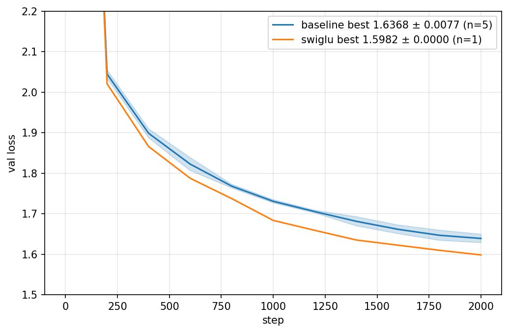
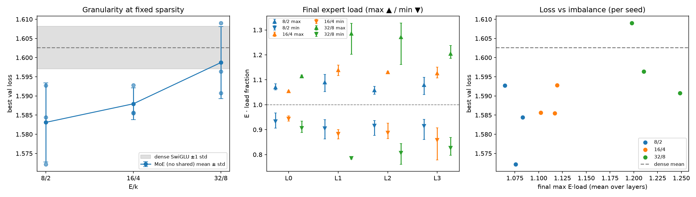

# my experimentation worklog

1) **Shorter iteraton budget**: To get a trustworthy baseline across variants, I'm giving training and eval their own seeded data generators, both pulled from the base config. Fixed seeds mean any difference between two runs comes from the thing I changed, not from batch order (training), and every run is scored on the same eval batches (otherwise eval noise looks like a real difference). I'm also raising eval_iters from 40 to 200 to further reduce noise, since max_iters has been cut to 2000 and with shorter runs, each eval point matters more.
> Note: 2000 iters * 16 * 128 tokens is about 4M tokens, which is roughly 4 epochs on tinyshakespeare (char-level). Pretty less, results won't be representative of the final quality but it's still fine for screening for now.
2) **Bug**: With targets, forward was returning flattened (B*T, C) logits. Generate and any other caller indexing logits[:, -1, :] would then get the wrong shape or the wrong rows. **Fix:** now we're flattening only for cross entropy, while logits maintain their orginal shape.

3) **Sanity check for [mlp + mha + layernorm + rope]**:

```text
[1] logits (32, 128, 65) (want (32, 128, 65))
    initial loss 4.4423  vs ln(vocab)=4.1744  -> OK

[2] params with grad=None: 0   all-zero grad: 0

[3] max diff at earlier positions: 0.00e+00 (want ~0)   at last position: 2.14e+00 (want > 0)
    -> OK

[4] overfitting one batch of 32 x 128 tokens for 300 steps (lr=0.001)
    PASS: loss 0.0095 < 0.1
```
- Note: this sanity check is run every time a new module is swapped in (e.g. mlp -> swiglu for the ffn). I only log it again if one of the checks fails; otherwise it's assumed to have passed before the ablation was run.

4) **LR sweep**
<p align="center">
  
</p>

Ran the baseline at 3e-4 (Best val loss = 1.7375), 1e-3 (1.6388) and 3e-3 (1.6414). 3e-3 learns faster early, but 1e-3 catches up and edges ahead by the end, so 1e-3 is the safer baseline and I'm freezing it for all later ablations. **Note:** There's a generalization gap. Val sits about 0.2 above train in every run (e.g. 1.64 vs 1.43 for 1e-3), which is expected on a small char-level dataset.

5) **Baseline x 5 seeds**

Ran the baseline config over 5 seeds; init_seed and train_seed move together; eval_seed stays fixed (at 4242) so every run is scored on the same eval batches.

| seed | best val | best iter | train @ best | gap | params | sec/iter |
|---|---|---|---|---|---|---|
| 1 | 1.6355 | 2000 | 1.4265 | 0.209 | 810,049 | 0.0538 |
| 2 | 1.6307 | 1800 | 1.4333 | 0.197 | 810,049 | 0.0528 |
| 3 | 1.6281 | 2000 | 1.4211 | 0.207 | 810,049 | 0.0518 |
| 4 | 1.6454 | 2000 | 1.4312 | 0.214 | 810,049 | 0.0546 |
| 5 | 1.6441 | 1800 | 1.4419 | 0.202 | 810,049 | 0.0534 |
| **mean ± std** | **1.6368 ± 0.0077** | | | 0.206 ± 0.006 | | 0.0533 |

<p align="center">
    
</p>

- The gap (val minus train) shows how much the model is overfitting, and its tiny spread (±0.006) means a variant whose gap moves clearly outside 0.206 changed how it generalizes, which tells you whether a val-loss win came from fitting better or from overfitting less.

## Ablations
- **Methodology note:** Every ablation is a single change on top of one frozen baseline [mha + mlp + layernorm + rope, bias=True lr=1e-3, 2000 iters], which was run on 5 seeds (best val 1.6368 ± 0.0077). Variants are run on seed 1 and scored against that 5-seed mean in std units. Verdicts: within 1 std = noise; beyond 2 std = real; 1 to 2 std = inconclusive, add seeds. Wins are not stacked: each ablation is independent, so results may not hold in combination (interactions are untested).

> A serious ablation gets a local decision rule and extra seeds (e.g. 3a: its own dense SwiGLU baseline plus 3 seeds per rung)

- **Scope:** Conclusions are for this toy regime (about 1M params) and treated as hypotheses, not scaling claims. Speed is not compared (free Colab noise, fused vs unfused kernels).

```python
# Training
batch_size = 16
block_size = 128                     
max_iters = 2000
learning_rate = 1e-3
# Model
n_embd = 128
n_head = 4
n_layer = 4
bias = True
```
### 1. Normalization

**1a. RMSNorm vs LayerNorm**
- Hypothesis: <1 std, slightly faster than layernorm (ms/iter) since it skips mean-centering and the bias term
- Config: --norm=rmsnorm, all else as baseline

| tag | best val | delta vs 5-seed mean (std units) | delta vs same-seed baseline | verdict |
|---|---|---|---|---|
| rmsnorm (s1) | 1.6368 | +0.0000 (0.0 std) | +0.0013 | noise |


- **Takeaway:** RMSNorm matches LayerNorm on val loss: 1.6368 vs the 5-seed mean of 1.6368 (+0.0000, 0.0 std; +0.0013 vs the same-seed baseline), so it's noise either way. It has 1,152 fewer params (9 norms × 128 bias terms, `ln_f` included), about 0.14% of the model, so effectively iso-param.

- **Speed:** No conclusions drawn from ms/iter since the baseline uses PyTorch's fused `nn.LayerNorm` and my RMSNorm is unfused, making the comparison unfair.

**1b. Normalization vs no normalization**
- TODO: add identity to NORM_REGISTRY (lambda config: nn.Identity()), so --norm=identity removes every norm including ln_f. Then run an LR sweep {3e-4, 1e-3, 3e-3, 1e-2} for layernorm vs identity, one seed each.

### 2. FFN

**2a. SwiGLU vs MLP**
* Hypothesis: >2 std since swiglu learns better, similar param count ([why SwiGLU is better than a plain MLP](../model/README.md#swiglu-vs-mlp))
* Config: --ffn=swiglu, all else as baseline

| tag | best val | delta | best iter | gap | params | verdict |
|---|---|---|---|---|---|---|
| baseline (mlp) | 1.6368 | n/a | | 0.206 | 810,049 | n/a |
| swiglu (s1) | 1.5982 | -0.0385 (-5.0 std) | 2000 | 0.218 | 806,977 | real (better) |

<p align="center">
  
</p>

* Takeaway: my SwiGLU implementation has bias off by default (copied from standard impls, on the reasoning that at large scale dropping biases saves a bit of compute without hurting loss), which explains the lower param count. A fairer comparison at this small scale would give swiglu the same bias=True default as the rest.

___

**2b. Granularity at fixed sparsity**
- Config: --ffn=moe_deepseek --num_experts=E --k=k --num_shared_experts=0 --bias=False, all else as baseline

- Setup: E/k of 8/2, 16/4 and 32/8 (num_shared_experts=0, multiple=1). Width is then d = 8(128)/(3k), so active and total params are roughly same on every rung, and the only thing that varies is how finely the FFN is split.

- Measured: best-val loss over 3 seeds per rung, plus min/max expert load from topk_idx at the end of training.


| E/k | Expert width | FFN active params | FFN total params | best val (mean ± std) | vs dense | busiest / least-used |
|---|---|---|---|---|---|---|
| dense | n/a | 523,776 | 523,776 | 1.6026 ± 0.0056 | n/a | n/a |
| 8/2 | ≈171 | 529,408 | 2,105,344 | 1.5831 ± 0.0103 | −0.0195 | 1.08 / 0.92 |
| 16/4 | ≈85 | 530,432 | 2,097,152 | 1.5879 ± 0.0042 | −0.0147 | 1.11 / 0.89 |
| 32/8 | ≈43 | 544,768 | 2,129,920 | 1.5987 ± 0.0094 | −0.0039 | 1.22 / 0.83 |

> load = E * fraction at final eval, max/min over experts, averaged over layers and seeds; 1.0 = uniform


<p align="center">
  
</p>


- Takeaways:
1) *Coarse MoE beats dense, but finer splitting erodes the gain.* 8/2 and 16/4 are better than dense. Active width is fixed, so more experts just means skinnier ones (171 -> 85 -> 43 hidden units at C=128). Char-level Shakespeare is one homogeneous blob, so there’s not much for a router to specialize on, and with no shared experts every skinny expert ends up relearning the same common stuff.

> Note (Param matching): FFN params are summed over 4 layers; runs use bias=False. Per layer, active = k·3C·d + C·E, with d = round(8C/(3k)). Expert params are matched to within about ±1% of dense (rounding of d). The router (C·E) is the main source of mismatch and grows with E: 0.8% / 1.5% / 3.1% of active FFN params at 8/2, 16/4, 32/8. Total active FFN params are therefore +1.1%, +1.3% and +4.0% over dense. Total = E·3C·d + C·E.
> 
> Caveat. 32/8 has about 4% more active params than dense, which would favor it, yet it performs worst, so the mismatch doesn’t threaten the conclusion that finer splitting doesn’t help.

2) *Load imbalance doesn’t explain the loss.* Imbalance grows mildly with E (busiest expert 1.08x -> 1.22x the even share) with no dead experts. Within a rung it doesn’t track loss, so the drop in benefit is better attributed to granularity itself. 

TODO: test the "relearning common stuff" explanation by rerunning 16/4 and 32/8 with num_shared_experts=1 at the same active params. If fine-grained recovers toward 8/2, shared experts are what make granularity pay off. Also rerun dense with bias=False to match the MoE runs accurately.

