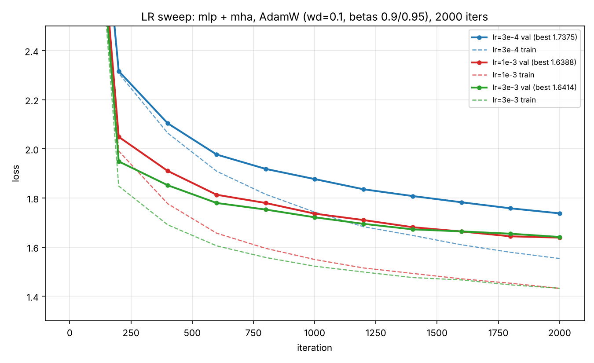
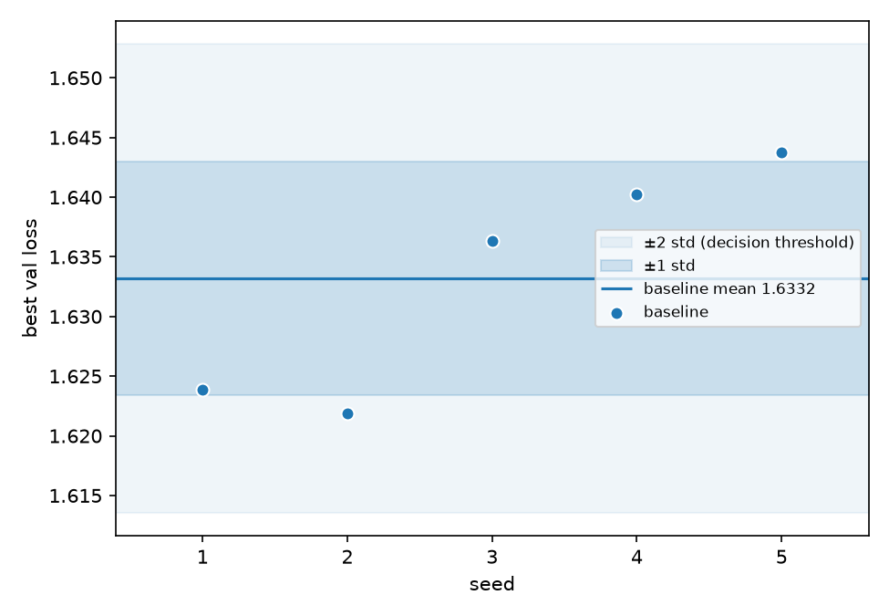

# my worklog

> config changes, bugs found and fixed, and sanity-check results across architecture combinations.

1) **Shorter iteraton budget**: To get a trustworthy baseline across variants, I'm giving training and eval their own seeded data generators, both pulled from the base config. Fixed seeds mean any difference between two runs comes from the thing I changed, not from batch order (training), and every run is scored on the same eval batches (otherwise eval noise looks like a real difference). I'm also raising eval_iters from 40 to 200 to further reduce noise, since max_iters has been cut to 2000 and with shorter runs, each eval point matters more.
2) **Bug**: With targets, forward was returning flattened (B*T, C) logits. Generate and any other caller indexing logits[:, -1, :] would then get the wrong shape or the wrong rows. **Fix:** now we're flattening only for cross entropy, while logits maintain their orginal shape.

3) **Sanity check for [mlp + mha + layernorm]**:
```text
[1] logits (32, 128, 65) (want (32, 128, 65))
    initial loss 4.4423  vs ln(vocab)=4.1744  -> OK

[2] params with grad=None: 0   all-zero grad: 0

[3] max diff at earlier positions: 0.00e+00 (want ~0)   at last position: 2.14e+00 (want > 0)
    -> OK

[4] overfitting one batch of 32 x 128 tokens for 300 steps (lr=0.001)
    PASS: loss 0.0095 < 0.1
```
4) **LR sweep**
<p align="center">
  
</p>

Ran the baseline at 3e-4 (Best val loss = 1.7375), 1e-3 (1.6388) and 3e-3 (1.6414). 3e-3 learns faster early, but 1e-3 catches up and edges ahead by the end, so 1e-3 is the safer baseline and I'm freezing it for all later ablations. **Note:** There's a generalization gap. Val sits about 0.2 above train in every run (e.g. 1.64 vs 1.43 for 1e-3), which is expected on a small char-level dataset.

5) **Baseline x 5 seeds**


| seed | best val | best iter | train @ best | gap | params | sec/iter |
|---|---|---|---|---|---|---|
| 1 | 1.6239 | 2000 | 1.4258 | 0.198 | 805,441 | 0.0453 |
| 2 | 1.6219 | 2000 | 1.4214 | 0.201 | 805,441 | 0.0445 |
| 3 | 1.6363 | 2000 | 1.4287 | 0.208 | 805,441 | 0.0461 |
| 4 | 1.6402 | 2000 | 1.4302 | 0.210 | 805,441 | 0.0447 |
| 5 | 1.6437 | 1800 | 1.4431 | 0.201 | 805,441 | 0.0453 |
| **mean ± std** | **1.6332 ± 0.0098** | | | 0.203 ± 0.005 | | 0.0452 |

<p align="center">
    
</p>

- **Decision rule:** Baseline best val is 1.6332 ± 0.0098 over 5 seeds, so a variant is clearly different only if it lands outside the ±2 std band (about 1.613 to 1.653) and is noise if it stays within 1 std. In between, I'll rerun it at seeds 2-5 and count it only if the mean gap exceeds 2 std and the sign matches in at least 4 of 5 paired seeds.
- The gap (val minus train) shows how much the model is overfitting, and its tiny spread (±0.005) means a variant whose gap moves clearly outside 0.203 changed how it generalizes, which tells you whether a val-loss win came from fitting better or from overfitting less.
- Four seeds peaked at iter 2000 and seed 5 at 1800, so the runs are still improving slightly at the end of 2000 iterations.
